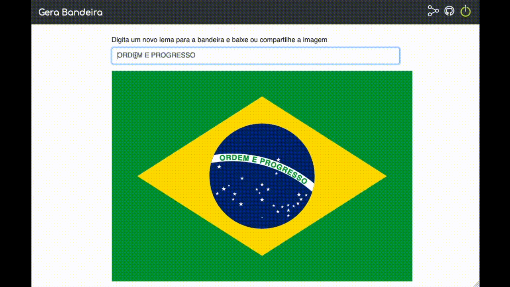

## 🇧🇷 Gerador de bandeira
Uma forma simples de gerar o seu próprio lema da bandeira e compartilhar por aí! **[Acesse aqui](https://gerabandeira.netlify.app/)**

É possível interagir via twitter com o robô [@lemadobrasil](https://twitter.com/lemadobrasil) mandando a sua sugestão seguindo os gatilhos e [explicados aqui](https://twitter.com/lemadobrasil/status/1523895283876257798)
## 🥞 Stack
- site feito apenas com html e o poder da Canvas API
- apis feito com Node.js
- GCP Functions
- GCP Task Scheduler
- GCP Cron Scheduler
